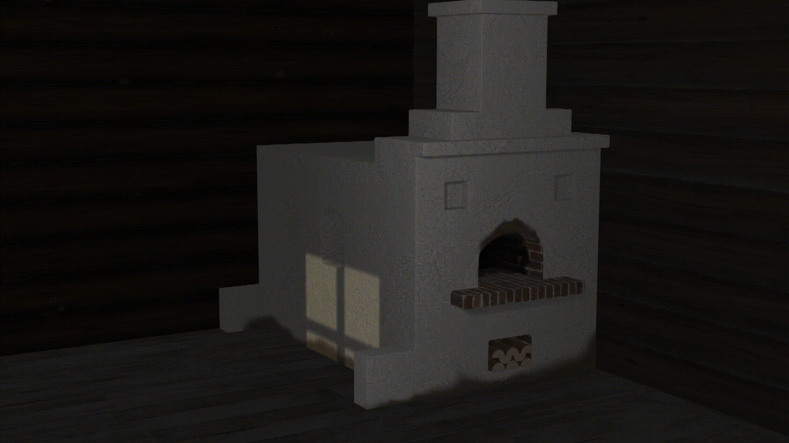

# Русская Печь

В репозитории представлена модель русской печи, сделанная при помощи Blender. Помимо мэша печи модель также содержит наложенные текстуры, анимацию и композитинг рендера.

В директории [assets/](./assets/) представлены референсы и PBR-материалы модели. В директории [out/](./out/) находятся экспорты модели в различные форматы.

### Референс печи

### Рендер модели

### Анимация

